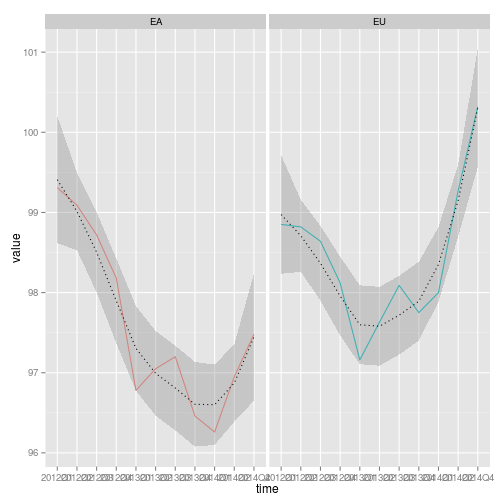

My HPIapp Presentation
========================================================
author: Cherie
date: Mon Jun 15 10:12:39 2015
transition: rotate

A simple House Price Index App
========================================================

This simple app allows you to view the House Price Index for a country in the EU. 
<small>
HPIs have a variety of potential uses:
- for assessing housing affordability over time
- a measure of specific price trends
- for inflation targeting
- for monitoring economic imbalances and financial stability
- as input for national accounts purposes
- as input to economic forecasting and analysis
- as input for decision making in respect of the house market.

Generally, HPIs can be considered suited for cross-country economic comparisons of the evolution of house prices.
</small>
Overall HPI for the EU and EA
========================================================
<small> The HPI differs across the European Union and European Economic Area. The European Economic Area (EA) includes EU countries and also Iceland, Liechtenstein and Norway. </small>
 

How did HPIs differ across the EA?
========================================================

 

References and sources
===
<small>
- The House Price Index (HPI) measures price changes of all residential properties purchased by households (flats, detached houses, terraced houses, etc.), both new and existing, independently of their final use and their previous owners. Only market prices are considered, self-build dwellings are therefore excluded. The land component is included.

- The url for EuroStat website is: http://ec.europa.eu/eurostat/data/database

- The file is "House Price Index (2010 =100) - quarterly data (teicp270)".
</small>
